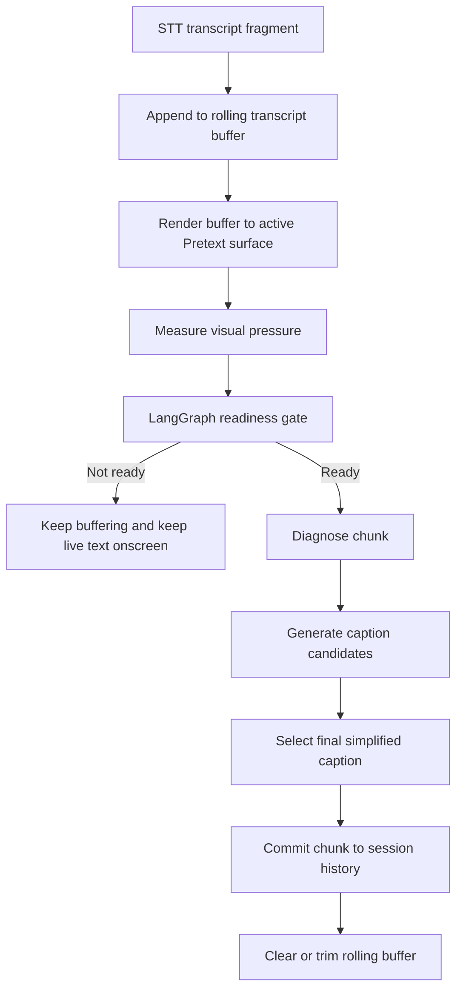

# Simplification Trigger Design

## Purpose

This note defines when Vera should start LLM simplification for live captions.

The current chunk-based behavior is too eager because it triggers simplification as
soon as STT returns a recorder slice. That means the LLM is often working on
arbitrary audio chunks instead of stable, readable language units.

## Goal

Trigger simplification only when there is enough meaningful text to improve the
screen, while still reacting quickly when the live surface becomes hard to read.

## Core Principle

Vera should simplify on **readiness**, not merely on **audio arrival**.

Readiness comes from two signals:

- semantic stability: we likely have a complete or near-complete thought
- visual pressure: the current live surface is becoming dense enough that the user
  needs relief

## Recommended Trigger Model

### Trigger 1: sentence stability

Simplification is ready when the buffered transcript likely contains a stable
sentence boundary.

Signals:

- sentence-ending punctuation such as `.`, `?`, `!`, `:`
- a transcript that is long enough to be meaningful even if punctuation is missing
- optional future inputs such as STT confidence or pause timing

### Trigger 2: visual pressure

Simplification is also ready when the active Pretext surface is approaching
capacity.

Signals:

- surface occupancy crossing a threshold
- the layout falling to the minimum allowed font size
- overflow pressure on the active live region

### Trigger 3: forced flush

Simplification should also run when the user stops listening and there is still
buffered text.

## Initial Thresholds

These values are intentionally heuristic and should be easy to tune:

- sentence-ready minimum: `8` words
- density-ready minimum: `16` words
- visual pressure threshold: `0.74`
- minimum chunk worth flushing on stop: `4` words

## Runtime Flow

## Client Responsibilities

- maintain the rolling transcript buffer
- render the active buffer on the live surface
- report live surface metrics derived from Pretext
- force a final flush when listening stops

## Server Responsibilities

- evaluate whether the buffered transcript is ready for simplification
- run the existing diagnosis and candidate-generation graph only when ready
- return either:
  - a committed simplified chunk, or
  - a decision to continue buffering

## LangGraph Changes

Add a new readiness node before the current LLM nodes.

Proposed graph:

1. `assess_readiness`
2. conditional edge:
   - `buffer_only`
   - `diagnose_chunk`
3. `generate_candidates`
4. `select_caption`

This keeps the readiness decision deterministic and cheap while preserving the
existing LLM flow for true simplification work.

## Client / Server Contract

`POST /api/chunks/process` should receive:

- accumulated transcript buffer
- conversation history
- user preferences
- live surface metrics
- optional `forceSimplify`

The response should include:

- `shouldCommit`
- `pendingTranscript`
- `readinessReason`
- optional committed `chunk`
- reply suggestions when a chunk is committed

## Why This Model Fits Vera

- it avoids spending LLM latency on weak partials
- it respects the actual reading surface, not just token count
- it keeps the orchestration logic inside LangGraph where Vera already wants
  deterministic routing
- it stays easy to tune without rewriting the live UI
