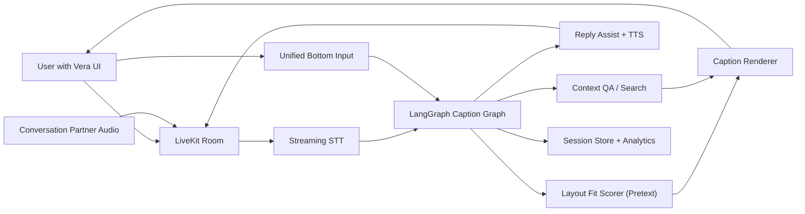
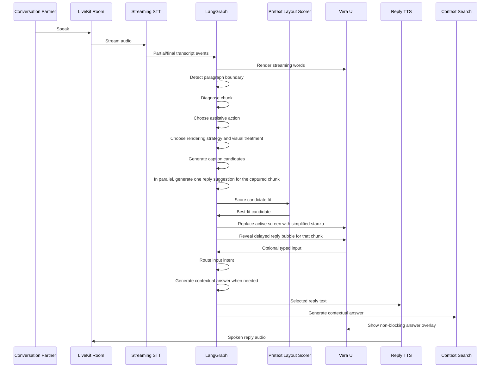
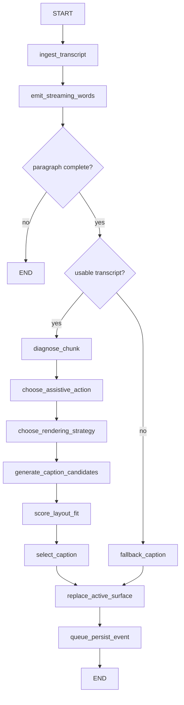
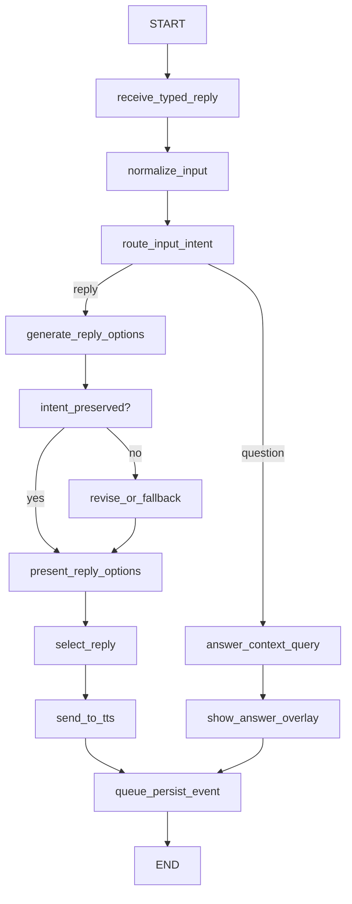
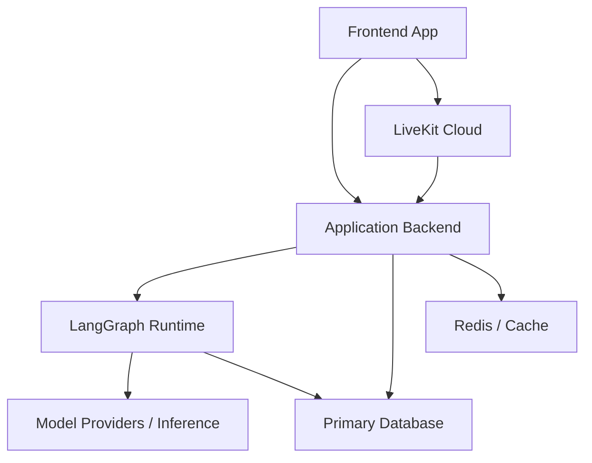

# Vera Technical Architecture

## Purpose

This document translates the Vera product direction into an implementation-oriented architecture. It is informed by:

- the Vera PRD
- the Sunva co-design workshop findings
- the `framework-selection` skill
- the `langgraph-fundamentals` skill
- the `livekit-agents` skill

## Architecture Decision Summary

### Framework choice

Based on the framework selection guidance, Vera should use `LangGraph` as the orchestration layer because the core workflow requires:

- branching based on transcript quality and layout fit
- explicit state management
- deterministic routing between assistive rendering strategies
- low-latency control over real-time decisions
- room for future human-in-the-loop or review flows

`Deep Agents` is not the right default for the live conversation path because the hot path needs predictable control flow rather than open-ended planning.

### Real-time media choice

Based on the LiveKit guidance, Vera should use `LiveKit` as the media and session layer because it is optimized for:

- real-time audio transport
- turn timing and low-latency interaction
- streaming voice infrastructure
- managed production-ready real-time communication

### Core architecture principle

Vera should be built as a two-plane system:

- `LiveKit` manages real-time audio and session infrastructure
- `LangGraph` manages stateful caption and response decisions

The layout engine acts as a deterministic scoring layer, not as the primary orchestration layer.

## High-Level System



## Why This Split Works

### LiveKit responsibilities

- room and participant session management
- real-time audio ingress and egress
- turn handling and voice transport
- connection quality and streaming primitives

### LangGraph responsibilities

- stateful decision-making
- transcript segmentation logic
- paragraph boundary detection
- chunk-level comprehension diagnosis
- caption candidate generation
- rendering strategy selection
- adaptive visual accessibility decisions
- input intent routing
- reply assistance
- contextual question answering
- persistence events and telemetry routing

### Layout scorer responsibilities

- determine whether candidate captions fit the viewport
- reduce unstable reflow
- score alternatives by readability and fit
- provide deterministic feedback into selection

## Core Runtime Flow



## Hot Path Design

The live caption hot path should remain minimal:

1. ingest transcript event
2. stream words to the active caption surface
3. detect paragraph boundary
4. diagnose chunk comprehension issues
5. choose assistive action
6. choose rendering strategy and visual treatment
7. generate limited caption candidates
8. score layout fit
9. replace active surface with finalized simplified stanza

Anything not required for immediate comprehension should be deferred off the hot path.

Examples of deferred work:

- analytics enrichment
- long-form summarization
- archival formatting
- extended quality scoring
- experimentation logs

## LangGraph Design Approach

Following the `langgraph-fundamentals` skill:

- the flow should be modeled as discrete nodes
- shared state should store raw facts and intermediate decisions
- nodes should return partial updates, not mutate full state
- routing should be explicit and testable
- reducers should be used only where state accumulation is required

## LangGraph State Model

The state should be compact and optimized for the current conversation window, not used as a dumping ground for every raw artifact.

### Suggested top-level state

```text
session_id
room_id
user_profile
readability_preferences
active_language
recent_utterances
current_utterance
active_stream_text
current_stanza
stanza_history
chunk_problem_types
assistive_action
rendering_strategy
visual_treatment
caption_candidates
selected_caption
reply_candidates
selected_reply
speaker_context
latency_metrics
persist_queue
error_state
```

### Suggested state categories

- `session metadata`: identity, room, language, preferences
- `conversation state`: recent utterances, speaker context, current turn
- `live render state`: active stream text, current stanza, swipe history
- `assistive state`: diagnosed problems, chosen action, confidence
- `caption state`: strategy, candidates, selected output, render metadata
- `reply state`: typed draft, rewrite options, chosen reply
- `query state`: intent, answer overlay payload
- `telemetry state`: timing, overflow, failure markers

## Caption Graph



## Unified Input Graph



## Assistive Decision Model

Vera should not treat `assistive_simplified` as a single summarization transform.

For each chunk, the graph should answer:

1. Is the raw chunk already understandable?
2. If not, what is the main comprehension problem?
3. What is the smallest helpful intervention?
4. What should be shown now versus exposed on demand?

This turns the assistive layer into a policy-driven decision system instead of a generic rewrite step.

### Diagnosable chunk problems

The graph should be able to classify problems such as:

- dense or formal language
- filler or noise clutter
- too much information for current reading pace
- misleading transcript wording
- multilingual or mixed-language phrasing
- difficult terms requiring explanation
- low-confidence recognition

### Assistive actions

The graph should choose one primary action per chunk, with room for secondary enrichments.

- `keep_verbatim`
- `clean_transcript`
- `simplify_language`
- `compress_for_speed`
- `highlight_key_info`
- `repair_misleading_text`
- `preserve_mixed_language`
- `attach_explanation`
- `mark_low_confidence`

The default policy should prefer the smallest intervention that improves understanding while preserving trust.

## Rendering Strategy Model

The architecture should support at least three internal runtime rendering strategies from day one:

- `verbatim`
  Best when the raw transcript is already sufficiently understandable.
- `assistive_simplified`
  Best when readability is the priority and meaning can be preserved in simpler form.
- `compressed_urgent`
  Best when space or reading time is limited and the system must preserve only the most important information.

These should be first-class outputs of the graph, not ad hoc prompt styles.

`assistive_simplified` should therefore be understood as an umbrella strategy whose internal behavior depends on the chosen chunk action.

The UI should not require the user to manually switch between these strategies during normal operation. The graph should choose them automatically per chunk based on:

- diagnosed comprehension problems
- layout fit constraints
- reading profile
- visual accessibility needs
- conversation urgency

The UI should not spend active screen real estate on explaining the chosen strategy during live transcription. Strategy details are implementation concerns unless the user explicitly asks for them.

## Candidate Generation Strategy

To preserve latency, Vera should not run open-ended caption regeneration loops by default.

Recommended strategy:

1. detect stanza or paragraph completion
2. diagnose the chunk
3. choose an assistive action
4. choose a rendering strategy and visual treatment
5. create a small number of candidates aligned to that action
6. run deterministic fit scoring
7. select the best candidate
8. only regenerate if all candidates fail a hard fit threshold

This aligns with the LiveKit skill guidance to reduce context bloat and unnecessary work during live interaction.

### What `generate_caption_candidates` means

This node should not blindly summarize text. It should produce a small set of caption options consistent with the chosen action.

Examples:

- if action is `clean_transcript`, candidates should differ mainly in noise removal and chunking
- if action is `simplify_language`, candidates should differ in reading complexity and density
- if action is `compress_for_speed`, candidates should differ in how aggressively they preserve only key information
- if action is `attach_explanation`, the primary caption may stay short while enriched metadata is attached for on-demand expansion

## Layout Fit Layer

The layout engine should evaluate candidate captions against:

- viewport width
- line count target
- maximum character density
- highlight styling impact
- user-configured reading profile
- adaptive visual treatment constraints

### Suggested scoring dimensions

- semantic preservation score
- fit score
- stability score
- reading density score
- emphasis clarity score

### Layout policy

- prefer stable line breaks over constantly changing wraps
- avoid large vertical jumps
- avoid highlight styles that increase overflow risk
- degrade gracefully from simplified to compressed when necessary
- optimize for one active live canvas plus one focused finalized chunk in the primary viewport rather than multi-card transcript stacking
- keep older history in discrete swipe pages so it does not compete in the main reading surface

## Pretext Integration

`Pretext` should be treated as the current recommended implementation for the layout scoring role.

### Architectural role

In Vera, `Pretext` is not the orchestrator and not the language-generation layer. Its job is to deterministically evaluate how candidate text will occupy space before the UI renders it, and to support the live canvas renderer that paints word-by-word text during an active utterance.

This allows the graph to choose captions based not only on meaning, but also on actual visual fit.

### Why Pretext fits Vera

Pretext is useful because Vera's product problem is not just transcript rewriting. It is readability under visual and time constraints.

For Vera, this means Pretext can help:

- determine whether a caption fits within line and width limits
- stabilize line breaks before render
- compare multiple candidate captions fairly
- reduce reflow and jumping layouts
- support user-specific density or reading-speed configurations
- support adaptive visual accessibility behaviors before render
- drive a canvas-based live caption surface without DOM measurement thrash
- support smooth active type-size reduction as the live utterance consumes more space
- support line-by-line rendering for the active streaming canvas
- size the focused finalized chunk so it remains large and readable in the shared live viewport
- size the focused full-transcript expansion without collapsing into dense history text
- support app-like page transitions without introducing scrolling transcript layouts

### Inputs to Pretext

The layout scorer should receive:

- candidate text
- viewport or caption container width
- viewport or caption container height
- target line count
- typography settings
- emphasis or highlight metadata
- user reading profile or density target
- current visual accessibility treatment
- current live-canvas phase such as `large_intro`, `mid_fill`, or `dense_fill`
- focus mode such as `live_active`, `latest_simplified`, `history_simplified`, or `focused_full_transcript`

### Outputs from Pretext

The scorer should return structured layout metadata such as:

- whether the candidate fits
- predicted line breaks
- overflow status
- fit score
- stability score
- density score
- suggested active type size for the current live utterance
- suggested type size for the currently focused finalized chunk
- per-line layout data for canvas rendering

### How Pretext fits the graph

The graph should work like this:

1. stream words into the active live surface
2. measure and lay out the active canvas with `Pretext`
3. detect paragraph completion
4. diagnose chunk comprehension issues
5. choose an assistive action
6. choose a rendering strategy and visual treatment
7. generate a small set of caption candidates
8. send those candidates to Pretext for deterministic scoring
9. replace the focused finalized slot with the selected simplified chunk and size it for reading with `Pretext`
10. move older history into discrete swipe pages and reopen the active canvas
11. if the user expands `Show Full`, rerun `Pretext` sizing for the focused full-transcript state

This keeps the graph policy-driven and keeps Pretext focused on verification and scoring.

### Recommended abstraction

The architecture should refer to the role as `Layout Fit Scorer` and `Live Canvas Layout Engine`, while allowing `Pretext` to be the first implementation behind both interfaces.

This gives Vera two advantages:

- the design can move forward with a clear implementation candidate now
- the layout engine can be swapped later without changing graph policy

### Fallback behavior

If Pretext is unavailable, Vera should fall back to a simpler heuristic layout scorer based on approximate width, line count, and density rules. This fallback should be less precise but must preserve continuity.

## Personalization Layer

Personalization should influence selection, not fork the system into many separate flows.

### Suggested profile fields

- preferred text size
- preferred pace/density
- preferred simplification aggressiveness
- preferred contrast and emphasis strength
- preferred language
- preferred reply tone
- preferred TTS voice

### Personalization examples

- slower reader -> lower density target
- lower-vision user -> stronger text size and emphasis treatment
- multilingual user -> allow mixed-language caption retention
- professional mode -> more formal reply rewrites

## Multi-Speaker Roadmap Design

The architecture should be ready for speaker-aware rendering even if perfect diarization is not in the MVP.

### Minimal early support

- track speaker segments when upstream STT provides them
- maintain `speaker_context` in state
- render provisional labels when confidence is sufficient

### Later evolution

- per-speaker color or layout grouping
- speaker-specific summaries
- speaker-specific memory within the active session window

## Data and Persistence Model

Vera should persist structured events, not only blob-like transcript dumps.

### Core entities

- `user_profile`
- `session`
- `utterance_event`
- `caption_candidate_event`
- `caption_selected_event`
- `reply_event`
- `tts_event`
- `latency_event`

### Why event-oriented persistence

- easier analytics
- easier replay/debugging
- easier model comparison
- better support for observability and product iteration

## Suggested Deployment Topology



## Required APIs And Services

Vera needs both platform services and product-specific APIs.

### Managed platform services

- `LiveKit Cloud`
- managed `Postgres`
- frontend hosting
- backend hosting
- secret management
- logging and error monitoring

### Runtime libraries and frameworks

- `LiveKit Agents SDK`
- `LiveKit frontend SDK`
- `LangGraph`
- `Pretext`
- frontend framework such as `Next.js`

## Product APIs

In addition to LiveKit room and session infrastructure, Vera should expose its own application APIs.

### Required application APIs

- `POST /session/bootstrap`
  Returns application session metadata and a LiveKit token for the client.
- `GET /user/preferences`
  Returns the user's language, readability profile, visual accessibility preferences, and TTS settings.
- `PUT /user/preferences`
  Updates accessibility and personalization settings.
- `POST /input/route`
  Routes live user input to either reply assistance or contextual question answering.
- `POST /sessions`
  Creates a structured conversation session.
- `POST /sessions/:id/events`
  Persists utterance, caption, reply, and telemetry events.
- `GET /sessions/:id`
  Returns session history and metadata for replay or review.
- `POST /feedback/caption`
  Stores user feedback such as too dense, misleading, or too fast.

### Optional early APIs

- `POST /glossary/explain`
  Expands a difficult word or phrase on demand.
- `GET /sessions/:id/export`
  Exports structured transcript history.

## Cloud Infrastructure Recommendation

The most practical initial deployment shape is:

- frontend app on `Vercel` or similar
- application backend and LangGraph runtime on `Cloud Run`, `Render`, `Railway`, or `Fly.io`
- `LiveKit Cloud` for realtime media and agent deployment
- managed `Postgres` for persistence
- optional `Redis` for cache or ephemeral coordination
- `Sentry` for error monitoring
- optional `LangSmith` for graph and prompt debugging

### Why this is enough

This stack gives Vera:

- managed realtime media transport
- managed deployment and secrets for the agent
- durable persistence
- room to test graph logic separately from audio transport
- enough observability to tune latency and readability

## LiveKit Requirements

For Vera, LiveKit is the required real-time layer.

### Required LiveKit pieces

- `LiveKit Cloud` project
- `LiveKit CLI`
- `LiveKit Agents SDK`
- `LiveKit frontend SDK`

### Why Vera should start with STT-LLM-TTS

Vera needs transcript chunks as first-class artifacts because the assistive agent must inspect each chunk and decide how to transform it.

For that reason, Vera should start with a chained pipeline:

- STT
- LLM
- TTS

rather than a pure speech-to-speech realtime model for the core product loop.

### Recommended starting model stack

Use LiveKit Inference first unless a specific provider requirement forces a direct integration.

Suggested baseline:

- STT: `Deepgram Nova-3`
- LLM: `OpenAI GPT-4.1 mini`
- TTS: `Cartesia Sonic-3`

This is a practical starting point because it aligns with LiveKit's quickstart pipeline and keeps setup simpler.

## LangGraph Requirements

LangGraph should run in the backend or graph runtime service, not in the browser.

### LangGraph responsibilities in deployment

- execute chunk diagnosis and assistive routing
- create caption candidates
- coordinate Pretext scoring
- choose selected captions
- generate reply options
- emit persistence and telemetry events

### Persistence guidance

LangGraph state should remain session-scoped and operational. Long-term storage should be persisted into the application database as structured events.

## Pretext Runtime Placement

Pretext should initially run inside the backend or graph runtime service as part of the `Layout Fit Scorer` implementation.

This avoids early network hops on the hot path.

If needed later, it can be extracted behind a dedicated scoring service, but that should not be the default.

## Data Infrastructure

### Required

- `Postgres` for users, sessions, events, preferences, and analytics-friendly persistence

### Optional early

- `Redis` for ephemeral coordination, buffering, or cache
- object storage for exports or large artifacts
- analytics warehouse for long-term product analysis

## Secrets And Environment Variables

At minimum, Vera will need:

- `LIVEKIT_URL`
- `LIVEKIT_API_KEY`
- `LIVEKIT_API_SECRET`
- database connection URL
- application auth secret
- monitoring keys
- any direct provider API keys if not fully using LiveKit Inference

### Important note

When deploying on LiveKit Cloud, the LiveKit connection variables are injected automatically for the associated agent deployment.

## Local Development Requirements

### Required tools

- Python `>= 3.10`
- `uv`
- `LiveKit CLI`
- Node.js for the frontend
- package manager for the frontend
- a LiveKit Cloud project

### Local setup shape

1. run the frontend locally
2. run the backend and graph runtime locally
3. run the LiveKit agent in `dev` mode
4. connect the browser app to a LiveKit room
5. validate the chunk diagnosis and caption rendering loop

## Testing Stack

Vera should test the graph logic and the voice runtime separately as much as possible.

### Required test tools

- `pytest`
- `pytest-asyncio`
- LiveKit Agents testing helpers
- frontend browser tests such as `Playwright`

### What should be tested

- chunk diagnosis
- assistive action selection
- candidate generation policy
- Pretext scoring adapter behavior
- fallback behavior
- reply option generation
- selected caption rendering behavior
- end-to-end room integration

### Important LiveKit testing note

LiveKit's built-in testing helpers are text-first and do not require a LiveKit connection for most behavioral tests. This is useful for Vera because much of the core value is in chunk diagnosis and decision policy rather than raw audio transport.

## Recommended Initial Build Stack

If Vera were being built immediately, the default stack should be:

- frontend: `Next.js`
- realtime/media: `LiveKit Cloud`
- agent runtime: Python with `LiveKit Agents`
- orchestration: `LangGraph`
- layout scoring: `Pretext` behind the layout scorer interface
- persistence: managed `Postgres`
- tests: `pytest`, LiveKit testing helpers, and `Playwright`
- monitoring: `Sentry`

This is opinionated, but it is intentionally designed to reduce setup sprawl while preserving the architecture Vera needs.

## Service Boundaries

### Frontend app

- room connection
- caption rendering
- local UI preferences
- typed reply entry
- device and viewport measurements

### Application backend

- authenticated app APIs
- session bootstrap
- persistence
- graph invocation coordination
- analytics and policy services

### LangGraph runtime

- graph execution
- state transitions
- caption candidate selection
- reply assistance decisions

### LiveKit Cloud

- low-latency audio session infrastructure
- media transport
- session-level voice behavior

## Latency Budget Guidance

Following the LiveKit skill, latency should be treated as a first-class design constraint.

### Practical guidance

- keep prompts short
- keep tools minimal on the hot path
- avoid broad agent contexts
- avoid expensive multi-pass regeneration
- stream partial value whenever safe

### Operational target

The product should optimize for the perception of immediacy:

- partial transcript quickly
- transformed caption shortly after
- stable visual updates instead of long silent waits

## Reliability Strategy

### Fallbacks

- if candidate generation fails, render verbatim
- if layout scorer fails, render safest fitting caption
- if reply generation fails, speak typed text directly
- if TTS fails, preserve text output in the UI

### Error handling principles

- fail soft, not silent
- preserve conversation continuity
- surface minimal but actionable UI feedback

## Testing Strategy

The LiveKit skill explicitly requires tests, and this architecture should assume testing from the start.

### Required test layers

- graph node unit tests
- graph routing tests
- chunk diagnosis tests
- assistive action selection tests
- layout scoring tests
- reply option safety tests
- LiveKit session integration tests
- end-to-end caption rendering tests

### Minimum MVP tests

- transcript event routes to the correct assistive action
- diagnosed chunk problems lead to the expected transformation type
- overflow triggers alternate candidate selection
- reply options preserve user intent
- fallback path works when transformation fails

## Initial Repo Shape

```text
vera/
  apps/
    web/
    api/
  packages/
    graph/
    ui/
    domain/
    layout/
    telemetry/
  tests/
    integration/
    e2e/
  docs/
    PRD.md
    WORKSHOP_INSIGHTS.md
    ROADMAP.md
    TECHNICAL_ARCHITECTURE.md
```

## Recommended First Build Order

1. establish frontend shell and room bootstrap
2. define LangGraph state schema
3. implement transcript ingest and caption candidate flow
4. implement layout fit scoring
5. implement stable render events in the UI
6. add typed reply assist and TTS
7. add persistence and telemetry
8. add tests around routing, fit, and fallbacks

## Non-Goals For The First Technical Milestone

- full multilingual parity
- advanced multi-speaker attribution
- plugin ecosystem
- rich analytics dashboards
- long-form memory systems

## Summary

Vera should be implemented as a low-latency, stateful communication system where `LiveKit` owns the media path, `LangGraph` owns decision flow, and the layout layer enforces readability constraints before rendering. This architecture keeps the system fast, testable, and grounded in the real needs surfaced by the workshop research.
