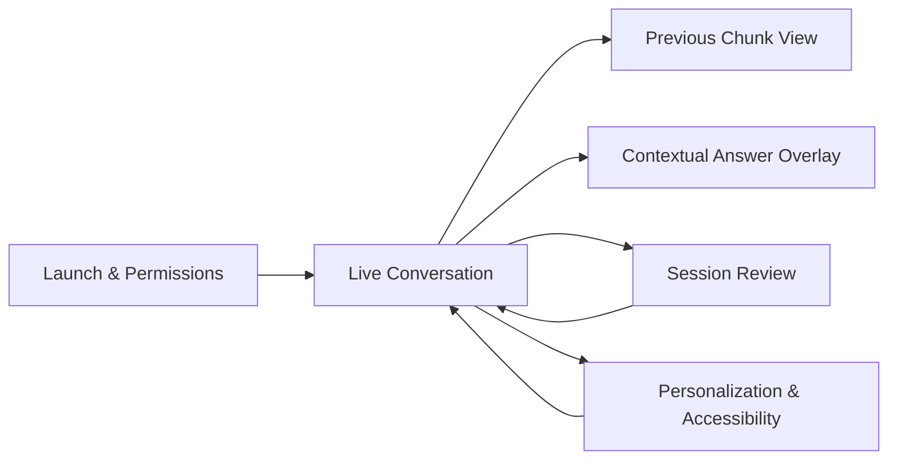
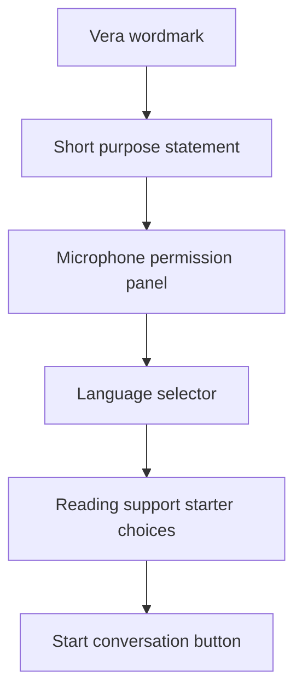
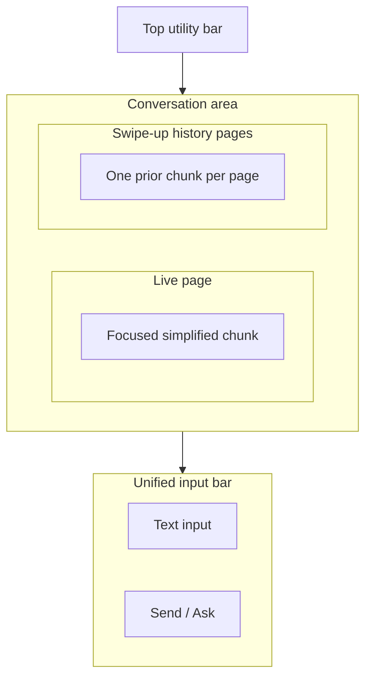
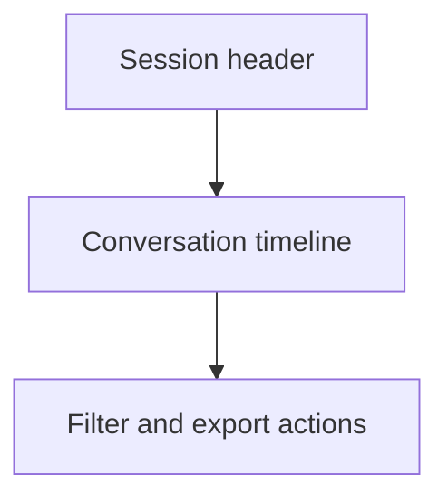
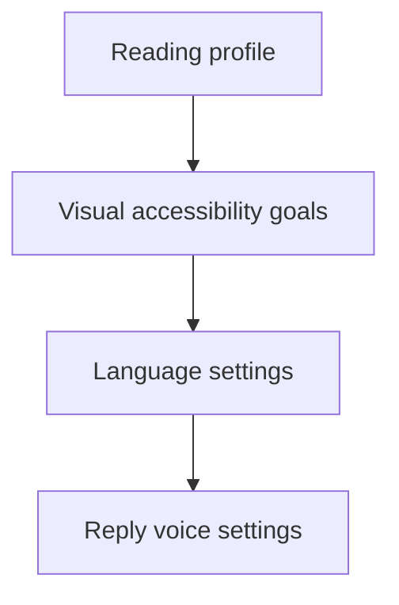

# Vera UI Screens

## Purpose

This document defines the primary user-facing screens for Vera and provides a design direction that is ready for implementation or input into a UI generation tool such as Stitch.

The screen system is designed for:

- low cognitive load
- strong readability
- stable caption rendering
- fast reply workflows
- clear accessibility behavior

## Design Direction

### Product character

Vera should feel:

- calm
- legible
- trustworthy
- practical
- non-clinical

It should not look like a generic AI dashboard or a decorative startup landing page.

### Visual principles

- typography must prioritize reading speed over visual flair
- actions should remain close to the content they affect
- the live conversation screen should minimize navigation friction
- the transformed caption should always feel primary
- original text should remain accessible through a compact switch button without competing visually

### UI guardrails

- use normal product UI patterns rather than experimental or decorative compositions
- avoid dashboard hero strips, eyebrow labels, decorative copy blocks, and glassmorphism
- avoid oversized radii, pill overload, floating shells, dramatic shadows, and gradient-heavy styling
- prefer plain headers, simple toolbars, standard inputs, and compact buttons
- keep borders subtle and shadows minimal
- do not spend space on ornamental notes explaining what the interface is doing
- favor predictable structure over creative asymmetry

### Color direction

Use a quiet light palette with strong text contrast and selective warm emphasis.

Suggested base palette:

- background: `#faf8f5`
- surface: `#ffffff`
- border: `#d9d4cc`
- primary text: `#1f1a17`
- secondary text: `#5f564f`
- accent: `#b45309`
- assistive highlight: `#1f7668`
- warning: `#b42318`

The palette should stay warm and calm. Avoid cool blue dominance.

### Component direction

- buttons should be standard rectangular or softly rounded controls, not pills
- cards should be used sparingly and only when they clarify grouping
- tabs should be simple if needed, but the main Vera flow should avoid unnecessary segmented controls
- overlays should feel like normal sheets or side panels, not floating glass panels
- the bottom input should look like a normal product input with clear borders and labels

## Screen Inventory

The MVP should include these screens:

1. launch and permission screen
2. live conversation screen
3. stanza history view
4. contextual answer overlay
5. session review screen
6. personalization and accessibility screen

## Screen Flow



## 1. Launch And Permission Screen

### Purpose

Help the user quickly:

- understand what Vera does
- grant microphone access
- choose language and baseline accessibility preferences
- enter the live conversation flow

### Layout



### Key elements

- plain language value statement
- microphone permission button
- default language selector
- starter text size or readability preference
- starter pace preference
- start button

### Notes

- no long onboarding carousel
- no decorative illustrations that compete with comprehension
- this screen should be functional and brief
- avoid marketing-style intro copy

## 2. Live Conversation Screen

### Purpose

This is the core product surface. The user should be able to understand speech, react quickly, and stay oriented without jumping between multiple UI areas.

### Layout



### Top utility bar

- session title
- connection status
- current language
- minimal chrome only

### Active conversation behavior

This is the most important UI surface.

The screen should behave as follows:

- default to a simplified caption view
- provide a single icon-only control in the bottom action row to switch to the `full-caption` view
- show only one caption form at a time in the main reading area
- in simplified mode, show one centered simplified chunk as the focused reading surface
- in simplified mode, allow the user to reveal that chunk's full text in place
- when full-caption mode is active, show a simple scrollable transcript surface with the current live running caption inline
- use deterministic text measurement and line layout for the focused simplified reading surface and the active live-caption region
- run chunk detection and simplification fully in the background during live rendering
- reveal older finalized chunks only after the user swipes upward into a separate history page flow
- show just one prior chunk per history page rather than a scrolling stack
- use `Pretext` for the focused simplified reading surface and the active live-caption region, not for the entire full transcript history
- preserve a calm, nearly full-screen reading surface with minimal chrome
- keep only subtle system indicators when absolutely necessary, such as connection state
- avoid extra chips, helper text, banners, empty waiting cards, or explanation blocks in the active reading area
- the screen should feel like a focused reader, not a live transcript monitor or generic chat feed

### Unified input bar

- anchored at the bottom
- can show AI-generated reply bubbles only when the latest committed chunk actually invites a response
- those bubbles should appear only after simplification and reply generation finish
- tapping a reply bubble should trigger spoken playback immediately
- accepts typed replies for TTS
- also accepts typed questions about the current conversation
- uses the same field for both intents
- intent routing should be automatic

## 3. Focused Chunk And Transcript Reveal

### Purpose

Allow the user to review prior finalized simplified chunks without disrupting the focused live reading surface.

### Behavior

- the primary live viewport should show one focused simplified chunk at a time
- older finalized chunks should remain available through separate swipe pages in chronological order
- reaching older history should require upward swipe navigation rather than scrolling
- the currently focused finalized chunk should default to simplified text
- the interface should use the global switch button rather than per-chunk expand controls
- transcript reveal should happen in place for the focused simplified chunk
- switching into the full-caption mode should show a continuous scrollable transcript view rather than a second card stacked in the same viewport
- the history experience should feel like app paging, not a decorative chat bubble list or scrolling transcript

### Contents

- simplified chunk text
- timestamp or relative order
- compact affordance to reveal the original transcription for the focused chunk

## 4. Contextual Answer Overlay

### Purpose

Display answers to user questions about the ongoing conversation without interrupting transcription.

### Behavior

- opens as a secondary overlay, sheet, or sidecar
- must not replace or block the active live canvas
- should be compact, readable, and dismissible
- should preserve the live conversation view underneath
- should look like a normal product sheet with straightforward spacing and controls

### Contents

- concise answer
- optional supporting points
- clear separation from the live caption flow

## 5. Session Review Screen

### Purpose

Allow saved conversation review without turning the app into a cluttered transcript archive.

### Layout



### Timeline design

Each timeline item should show:

- time
- speaker
- transformed caption
- optional original text access
- reply events

### Filters

- show only transformed captions
- show original and transformed
- show only user replies

## 6. Personalization And Accessibility Screen

### Purpose

Let the user shape Vera around their reading and communication needs while keeping real-time adaptation agentic.

### Layout



### Sections

#### Reading profile

- reading pace target
- desired amount of simplification
- show original availability toggle
- low confidence warning toggle

#### Visual accessibility goals

- text size
- density preference
- high contrast mode
- emphasis strength preference

#### Language settings

- preferred language
- multilingual preservation toggle
- mixed-language preference

#### Reply settings

- default tone
- TTS voice
- preview speed

## Primary Screen States

The live conversation screen must support these states cleanly:

- waiting for permission
- listening
- receiving streaming word-by-word transcript
- active canvas at large type
- active canvas compacted to smaller type
- paragraph boundary detected
- simplified stanza committed to the focused reading surface
- user expanding a prior chunk transcript
- user swiping between live and history pages
- contextual answer overlay open
- low confidence
- offline or reconnecting
- text input composing
- reply speaking

## Mobile Behavior

### Mobile rules

- live caption stream stays primary
- the active live canvas should occupy almost the full screen when the current utterance begins
- the last finalized chunk should remain in the focused viewport and stay large enough to read comfortably
- older history should be reached through vertical swiping, not scrolling
- contextual answers should appear in a non-blocking overlay
- the bottom input should always remain reachable

### Avoid

- tiny floating controls
- sidebars
- overly dense toolbars
- decorative overlays
- dashboard cards stacked inside the live screen
- explanatory helper paragraphs inside the active reading surface

## Accessibility Notes

- transformed caption text should be visually dominant
- active streaming text should remain highly legible throughout its size transitions
- minimum hit targets should be comfortable
- key actions must be reachable with one hand on mobile
- visual state changes must not depend on color alone
- layout should remain stable during rapid updates
- typography scaling should be smooth, deterministic, and free from sudden jumps

## Stitch-Ready Prompt

Use this prompt as a starting point in a UI generation workflow:

```text
Design a calm, accessibility-first web and mobile interface for a product called Vera, a real-time assistive communication app for deaf and hard-of-hearing users. The default live screen should show one centered simplified caption chunk as the primary reading surface. When the user switches modes with a compact icon-only control in the bottom action row, show a full-caption view with a simple scrollable transcript and the current running caption inline. Use `Pretext`-style measured layout for the focused simplified reading surface and the active running-caption region, but keep past transcript history plain and scrollable. When a paragraph or stanza is complete and simplification finishes, the focused simplified chunk should update without turning the screen into a transcript feed. Older chunk history should not scroll in the live page. Instead, the user should swipe upward into separate app-like history pages, with one prior chunk per page. The focused simplified chunk should offer an in-place way to reveal its original full text. Above the bottom input, show AI-generated reply bubbles only when the latest committed chunk clearly invites a response; tapping a bubble should immediately speak that reply aloud. A single bottom text box should still support both TTS replies and typed questions about the active conversation. An AI agent should route the input intent automatically to either reply playback or contextual search. Search answers must appear in a secondary overlay or sidecar that does not disturb the live reading surface. Prioritize strong readability, low cognitive load, stable text layout, app-like paging, and minimal chrome. Use normal product UI patterns: simple headers, compact controls, standard inputs, restrained borders, minimal shadows, and straightforward sheets. Avoid generic AI dashboard aesthetics, hero sections, eyebrow labels, decorative copy blocks, glowing cards, oversized rounded corners, pill-heavy controls, floating glass panels, decorative charts, and cool blue dominant palettes. Use a quiet warm light palette, strong contrast, restrained borders, and practical typography. Also design screens for launch and permissions, session review, and personalization settings focused on reading pace goals, density goals, language, visual accessibility, and TTS settings.
```

## Implementation Guidance

If these screens are implemented in code, start with:

- a single live conversation screen
- a `Pretext`-backed live canvas renderer
- a focused simplified reader plus swipe-only history pages
- a non-blocking answer overlay
- a unified bottom input
- a compact personalization drawer

The screen system should grow from the live experience outward, not from a dashboard shell inward.
