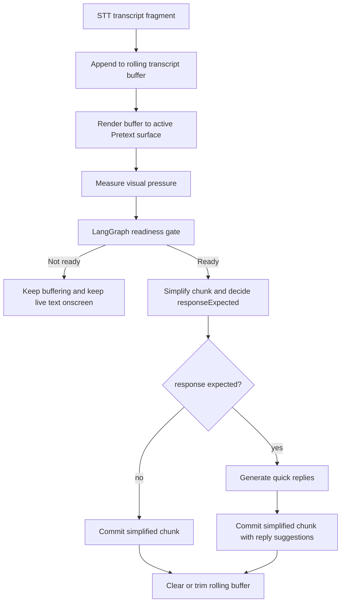

# Simplification Trigger Design

## Purpose

This note defines when Vera should start LLM simplification for live captions.

The current chunk-based behavior is too eager because it triggers simplification as
soon as STT returns a recorder slice. That means the LLM is often working on
arbitrary audio chunks instead of stable, readable language units.

## Goal

Trigger simplification only when there is enough meaningful text to improve the
screen, while still reacting quickly when the live surface becomes hard to read.

## Core Principle

Vera should simplify on **readiness**, not merely on **audio arrival**.

Readiness comes from three signals:

- semantic pause: we likely have enough stable language to rewrite without guessing
- thought completion: we likely have a fuller multi-sentence meaning unit
- visual pressure fallback: the current live surface is becoming dense enough that the user
  needs relief

## Recommended Trigger Model

### Trigger 1: semantic pause

Simplification is ready when the buffered transcript likely contains a stable
pause-sized thought.

Signals:

- sentence-ending punctuation such as `.`, `?`, `!`, `:`
- a transcript that is long enough to preserve meaning
- optional future inputs such as pause timing

### Trigger 2: thought completion

Simplification is also ready when the buffer contains a larger connected thought,
often spanning more than one sentence.

Signals:

- two or more connected sentence-like units
- enough total words to preserve context while still benefiting from compression

### Trigger 3: visual pressure fallback

Simplification is also ready when the active Pretext surface is approaching
capacity and the buffered text is already substantial enough to rewrite safely.

Signals:

- surface occupancy crossing a threshold
- the layout falling to the minimum allowed font size
- overflow pressure on the active live region

### Trigger 4: forced flush

Simplification should also run when the user stops listening and there is still
buffered text.

## Initial Thresholds

These values are intentionally heuristic and should be easy to tune:

- semantic-pause minimum: `18` words
- complete-thought minimum: `28` words
- max buffer: `42` words
- visual pressure threshold: `0.74`
- minimum chunk worth flushing on stop: `8` words

## Runtime Flow

## Client Responsibilities

- maintain the rolling transcript buffer
- render the active buffer on the live surface
- report live surface metrics derived from Pretext
- force a final flush when listening stops

## Server Responsibilities

- evaluate whether the buffered transcript is ready for simplification
- run simplification only when ready
- decide whether a reply is actually expected
- generate quick replies only for reply-worthy chunks
- return either:
  - a committed simplified chunk, or
  - a decision to continue buffering

## LangGraph Changes

Current graph:

1. `assess_readiness`
2. conditional edge:
   - `buffer_only`
   - `simplify_chunk`
3. conditional edge:
   - `commit_without_replies`
   - `generate_quick_replies`

This keeps the readiness decision deterministic and cheap while keeping reply
generation off the hot path for chunks that do not need a response.

## Client / Server Contract

`POST /api/chunks/process` should receive:

- accumulated transcript buffer
- conversation history
- user preferences
- live surface metrics
- optional `forceSimplify`

The response should include:

- `shouldCommit`
- `pendingTranscript`
- `readinessReason`
- optional committed `chunk`
- reply suggestions when a chunk is committed

## Why This Model Fits Vera

- it avoids spending LLM latency on weak partials
- it respects the actual reading surface, not just token count
- it keeps the orchestration logic inside LangGraph where Vera already wants
  deterministic routing
- it stays easy to tune without rewriting the live UI
